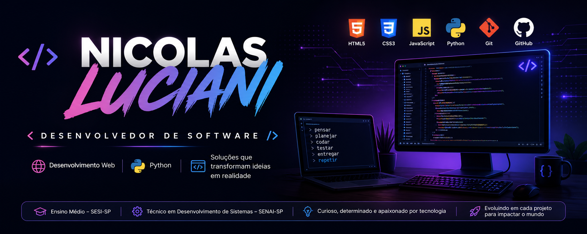

  
    
  

<h2>🧠 Sobre mim</h2>

- 🎓 Ensino Médio no **SESI-SP**  
- 💻 Técnico em **Desenvolvimento de Sistemas** no **SENAI-SP**  
- 🔍 Curioso e determinado, resolvo problemas com código e busco sempre criar soluções que impactem positivamente  
- 🌍 Busco evoluir em cada projeto e contribuir com ideias inovadoras  
 

<picture>
  <source media="(prefers-color-scheme: dark)" srcset="https://raw.githubusercontent.com/abozanona/abozanona/output/pacman-contribution-graph-dark.svg">
  <source media="(prefers-color-scheme: light)" srcset="https://raw.githubusercontent.com/abozanona/abozanona/output/pacman-contribution-graph.svg">
  
</picture>
<h2>📱 Contato</h2>

  
  
  
  

